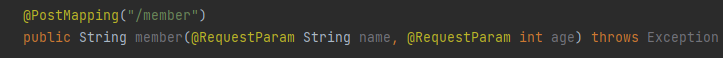

# 공부기록

## Spring MVC (Model, View, Controller)

### Spring MVC?

* Model / View / Controller 역할
* MVC 패턴의 목적은 Business Logic과 Presentation Logic을 분리하는 것이다.
  * Business Logic : 어떤 특정한 값을 얻기 위해 데이터 처리를 수행하는 응용프로그램의 일부(원하는 값을 얻기 위해 백엔드에서 일어나는 각종 처리)
  * Presentation Logic : 화면상의 디자인 구상을 위한 처리 (화면을 보여주기 위한 처리)
 * 역할별로 코드를 분리하여 하나의 파일에 코드가 모이는 것을 방지하기 때문에, 가독성과 코드 재사용이 증가한다.
 * 단점으로 View와 Model 사이의 높은 의존성 때문에 어플리케이이 커질수록 복잡해지고 유지보수가 어렵다.
 
 ### Model
 * Controller에서 View로 전달되는 데이터 객체이다.
 * Key-Value 형태를 가지며, 하나의(key-value)객체를 Model Attribute라고 한다.
 
 ### Controller
 * View와 Model 사이의 인터페이스 역할을 수행한다.
 * Request에따라 적절한 결과를 Model에 담아 View에 전달한다.
    (즉, View Name과 View에 출력할 Model을 반환한다.)
    
 ### View
 * Model 데이터 렌더링을 담당하여, HTML, Output을 생성한다.
 * 여러가지 템플 엔진이 존재한다.(ex. JSP, Thymleaf ...) 
 
 ### RequestMapping
 * 요청에 대한 어떤 controller, 어떤 메소드가 처리될지 맵핑하기 위한 어노테이션
 * 클래스나 메소드 선언부에 @RequestMapping과 함께 URL을 명시한다.
 * viewName 생략시 @RequestMapping의 Path로 설정한 URL이 default viewName
 
 ### RequestMapping 속성들
 
 1) value(String[]) : URL 값
  ex) @RequestMapping(/"admin/login")
  
 2) method(RequestMethod[]) : HTTP Request 메소드 값
  - GET, POST, PUT, DELETE ...
 
 3) params(String[]) : HTTP Request 파라미터
  * @RequestParam : 사용자가 원하는 매개변수에 값을 매핑하기 위해 사용한다.
  
  ex) 
  
  여기서 RequestParam은 생략 가능하다. 사용자가 입력한 key값과 매개변수 이름을 비교하여 값을 넣어주기 때문이다.
  
  * @PatuVariable : url 경로를 변수화하여 사용할 수 있도록 해준다.
  
  ex)
  @RequestMapping("/member/{name}/{age}")
  public String member(@PathVariable("name") String name, @PathVariable("age") String age)
  
  * RequestMapping의 {name}과 PathVariable의 String name을 매핑하여 준다.
  
## spring 특징

### 제어 역행(IoC : Inversion of Control)

 - 애플리케이션의 느슨한 결합을 도모.

 - 컨트롤의 제어권이 사용자가 아니라 프레임워크에 있어 필요에 따라 스프링에서 사용자의 코드를 호출한다.

 

### 의존성 주입(DI : Dependency Injection)

 - 각각의 계층이나 서비스들 간에 의존성이 존재할 경우 프레임워크가 서로 연결시켜준다.

### 관점지향 프로그래밍(AOP : Aspect-Oriented Programming)

 - 트랜잭션이나 로깅, 보안과 같이 여러 모듈에서 공통적으로 사용하는 기능의 경우 해당 기능을 분리하여 관리할 수 있다.

